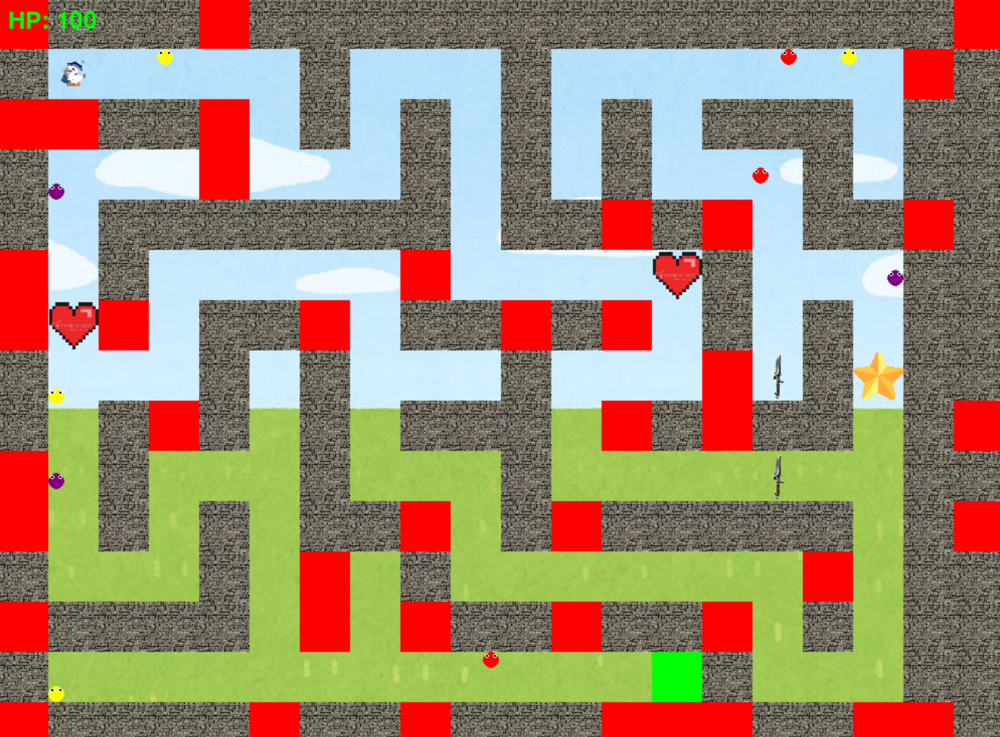

# めいろとん

## 実行環境の必要条件
* python >= 3.10
* pygame >= 2.1

## ゲームの概要
* ランダムに生成された迷路を進みゴールするゲーム
* 参考URL：[サイトタイトル](https://www.hoge.com/)

## ゲームの遊び方
* 矢印キーでこうかとんを操作して、壁に当たらないように迷路を進む
* こうかとんをHPが0になったらゲームオーバー

## ゲームの実装
### 共通基本機能
* 迷路の描画
* プレイヤーの位置とを計算し、経路の中で最も遠い位置にゴールを設置する

### 分担追加機能
* アイテムを拾い敵に触れると敵を倒せる機能
* HP回復機能
* ダメージ判定のある壁を追加
* 壁に触れると一定時間の無敵がある

### ToDo
- [古後] 壁のダメージ判定の追加
- [鳥澤] アイテムとそれに応じた能力の追加
- [宮崎] 敵もMOBの追加
- [花岡] デザイン
- [山下] 迷路の調整、ゲームバランス調整
